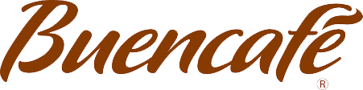

<!-- Project basic information  -->
[![Contributors][contributors-shield]][contributors-url]
[![Issues][issues-shield]][issues-url]
[![MIT License][license-shield]][license-url]

<br>
<p align = "center">

  <a href="https://github.com/nestorcalvo/Buencafe_dashboard">
    
  </a>

  <h3 align="center">Buencafé Dashboard</h3>

  <p align="center">
    Dashboard for Buencafé (fill info)
    <br />
    <br />
    <a href="http://ec2-54-144-134-190.compute-1.amazonaws.com:8050/apps/home">View Demo</a>
    ·
    <a href="https://github.com/nestorcalvo/Buencafe_dashboard/issues">Report Bug</a>
    ·
    <a href="https://github.com/nestorcalvo/Buencafe_dashboard/issues">Request Feature</a>
  </p>
</p>
<!-- ABOUT THE PROJECT -->

## About The Project

[![Product Name Screen Shot][product-screenshot]](http://ec2-54-144-134-190.compute-1.amazonaws.com:8050/apps/home)

Buencafé is one of the main worldwide providers of soluble coffee of outstanding quality that belongs to the Federación Nacional de Cafeteros de Colombia (FNC). 
It produces lyophilized coffee, roasted coffee, coffee extract and coffee oil.

## Notebooks
<ul>
  <li><a href="https://colab.research.google.com/drive/1p1RqSQHJXcEduxTb6EHxYFxMYU5eRI9j">Notebook 1</a></li>
  <li><a href="https://colab.research.google.com/drive/1lnE8Mjt6tbllGJz5PbYH6CSwNPz9Q7jA">Notebook 2</a></li>
</ul>

<!-- GETTING STARTED -->
## Getting Started

To get a local copy up and running follow these simple example steps.

### Prerequisites

List of things you need to use the software and how to install them.
* python libraries
  ```sh
  pip install -r requirements.txt
  ```
### Run the web application

The main file is index.py, to run the application in the localhost.
* run command
  ```sh
  python index.py
  ```
<!-- CONTACT -->
## Contact

Nestor Calvo - nestorcalvoa@gmail.com


Project Link: [https://github.com/nestorcalvo/Buencafe_dashboard](https://github.com/nestorcalvo/Buencafe_dashboard)

<!-- Links to badges (template, need repo in public) -->
[contributors-shield]: https://img.shields.io/github/contributors/othneildrew/Best-README-Template.svg?style=for-the-badge
[contributors-url]: https://github.com/nestorcalvo/Buencafe_dashboard/graphs/contributors

[issues-url]: https://github.com/nestorcalvo/Buencafe_dashboard/issues
[issues-shield]: https://img.shields.io/github/issues/othneildrew/Best-README-Template.svg?style=for-the-badge

[license-shield]: https://img.shields.io/github/license/othneildrew/Best-README-Template.svg?style=for-the-badge
[license-url]: https://github.com/nestorcalvo/Buencafe_dashboard/blob/master/LICENSE.txt
[product-screenshot]: images/Mockup-1Page_1.png
